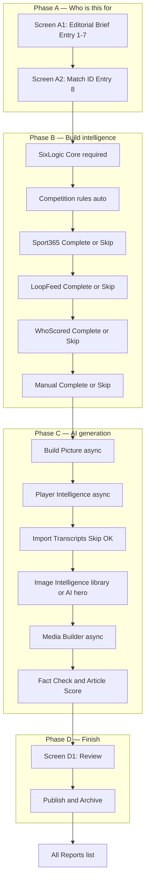

# Match Report Builder V1 — R&D Plan

> **Full R&D index:** [`docs/R&D/README.md`](R&D/README.md) · **Master report:** [`PLEXA_STUDIO_RD_REPORT.md`](../PLEXA_STUDIO_RD_REPORT.md) · **API:** `/api/docs/match-report-builder-rd`

**Product:** Planet Sport Studio (Plexa)  
**Repo:** `racing365-social` · Live: planetsport.studio  
**Status:** R&D / Prototype specification  
**Replaces:** Data Studio “dump raw FIXTURE_JSON to OpenAI” flow for football match reports

---

## 1. Executive summary

Match Report Builder is a linear, data-driven workflow that:

1. **Starts with WHO the content is for** — Sport → Content Type → Brand → Brand Style → Content Creator Profile → Creator Style → Editorial Guidelines
2. **Then collects match intelligence** — SixLogics core (required) + optional layers (Sport365, LoopFeed, WhoScored, manual, YouTube transcripts)
3. **Builds an Event Intelligence Object (EIO)** — never sends raw feed JSON to AI
4. **Generates original journalism** — match report, player ratings (centrepiece), 16 conclusions, hero + social images, social posts, scripts
5. **Persists everything** — reports + data files in blob store `plexa-match-report`
6. **Publishes** — Language Studio Review Queue

**V1 scope:** Football · Match Report (+ Match Preview in progress) · WhoScored for player stats (no Opta API yet)

**Match Preview R&D:** See [match-preview-v1-spec.md](./match-preview-v1-spec.md) and [match-preview-rd-report.md](./match-preview-rd-report.md) (F365 editorial benchmark, PIO, 9.5+ product target).

---

## 2. End-to-end user flow (master diagram)



**UX principle:** One task per screen · **Complete** or **Skip** · EIO builds incrementally · confidence updates after each step.

---

## R&D Addendum — Fact Check, Story Engine And Article Score

The Match Report Builder now includes an R&D layer between Media Builder and Review:

1. **Story Engine** — normalises match data into editorial context rather than raw stats dumps.
2. **Fact Check** — validates the generated report against source hierarchy.
3. **Article Score** — rates factual accuracy, research depth, insight, journalist voice, brand fit, opinion/humour and readability.

### Source hierarchy

| Tier | Source | Role |
|---|---|---|
| Tier 1 | SixLogic / EIO / Opta match feed | Goals, assists, cards, lineups, substitutions, match events, scores and table data. Cannot be overridden. |
| Tier 2 | Sofascore / WhoScored / Opta-style advanced data, official clubs, ESPN, Sky, BBC, Reuters, Premier League | xG, momentum, chance quality, quotes, records, milestones, injury comments and competition implications. Supplements Tier 1. |
| Tier 3 | AI editorial layer | Narrative, humour, opinion, tactical explanation, headlines and conclusions. Must be evidence-backed. |

### Loop Feed intelligence

Loop Feed is a research and editorial intelligence source, not only an embed source. It should provide:

- Club feed signals: official updates, reaction, injury/selection context, manager/player comments.
- Top journalist signals: trusted observations, tactical notes, mood, records, controversy and football conversation.
- Style signals: humour, opinion, attribution habits and phrasing patterns to support Content Creator profiles and brand style guides.

Loop Feed can support context and tone, but it must not override Tier 1 match data. Conflicts become Fact Check Warnings.

### Sofascore / advanced data target

When available, parse all statistics periods:

- `ALL` as full-time.
- `1ST` as first-half.
- `2ND` as second-half.

Keep grouped stats for Match overview, Shots, Attack, Passes, Duels, Defending and Goalkeeping. These feed the Story Engine and fact-check warnings.

### Article Score

Score reports out of 100:

| Dimension | Points |
|---|---:|
| Factual accuracy | 25 |
| Research depth | 15 |
| Insight quality | 15 |
| Journalist voice / Content Creator fit | 15 |
| Brand fit | 15 |
| Opinion and humour | 10 |
| Structure/readability | 5 |

High-severity Tier 1 contradictions cap the score at 65. Unsupported direct quotes cap the score at 75 unless sourced.

### R&D comparison test

Primary test case: Brighton 0-3 Manchester United.

Expected improvements:

- Catch wrong team/player ownership such as “Brighton’s Kobbie Mainoo”.
- Catch possession contradictions.
- Use Dorgu 33, Mbeumo 44 and Fernandes 48 from Tier 1.
- Use Sofascore-style advanced data to explain Brighton territory versus United chance quality.
- Use Loop Feed for research/style signals, not automatic embeds.
- Score whether the article reads like researched journalism, not generic AI sports copy.

---

## 3. Entry Steps 1–7 — Editorial brief (WHO)

**Screen A1:** “Who is this content for?” — **nothing touches match data until Continue.**

| Step | Field | UI | Stored on |
|---|---|---|---|
| 1 | **Sport** | Football (V1 only) | `EditorialProfile.sport` |
| 2 | **Content Type** | Match Report (locked badge) | `contentStyle: "Match report"` |
| 3 | **Brand** | Football365 / TEAMtalk / Planet Football / Sport365 | `targetBrand` |
| 4 | **Brand Style** | Auto-loaded read-only preview | `brandStyle` |
| 5 | **Use Content Creator Profile** | Checkbox + dropdown | `useCreatorProfile`, `journalistProfileId` |
| 6 | **Creator Style** | Textarea (from profile, editable) | `creatorStyleNotes` |
| 7 | **Article / Editorial Guidelines** | Textarea (from profile, editable) | `articleGuidelines` |

### Brand → Brand Style

| Brand | Brand Style | EIO emphasis |
|---|---|---|
| **Football365** | Opinionated — punchy takes, debate | LoopFeed, opinion |
| **TEAMtalk** | Transfer-focused — squad narrative | Player names, futures |
| **Planet Football** | Social-led — shareable hooks | Headlines, social outputs |
| **Sport365** | Stats-focused — xG, ratings, tables | WhoScored, Sport365 commentary |

### Content Creator Profile implementation

**Source:** Language Studio governance store — `LanguageJournalistProfile` in `data/local/language-studio.json`

**Reuse:**
- Types: `app/lib/language-studio/types.ts`
- Profile list: `GET /api/language/governance` → `journalistProfiles`
- UI pattern: `app/language-studio/LanguageStudioClient.tsx` Rewrite tab

**Flow:**
1. User checks **Use Content Creator Profile**
2. Dropdown filtered by `targetBrand` + sport = football
3. On select → populate **Creator Style** (`styleNotes`) and **Editorial Guidelines** (`articleGuidelines`)
4. User may edit textareas before Continue
5. Saved to `projects/{id}/editorial/profile.json`
6. Injected into every AI step via `editorial-governance.ts`

**Module:** `app/lib/match-report/editorial-governance.ts`

```typescript
async function resolveEditorialContext(profile: EditorialProfile) {
  const store = await readLanguageStudioStore();
  const journalist = profile.journalistProfileId
    ? store.journalistProfiles[profile.journalistProfileId]
    : null;
  const knowledgeFiles = pickKnowledgeFiles(store, profile.targetBrand, "Match report");
  const promptRules = activeRules(store.promptRules, "Match report");
  const sportRules = matchSportRules(store.sportRules, "football", profile.competitionCode);
  const layerWeights = resolveLayerWeights(knowledgeFiles, profile.targetBrand);
  return { journalist, knowledgeFiles, promptRules, sportRules, layerWeights, profile };
}
```

**Layer weights** stored in Knowledge Files (`seed-knowledge-match-report-layer-weights` + brand voice seeds). SixLogic facts always weight **1.0** — weights affect narrative emphasis only.

---

## 4. Entry Step 8 — Match ID (Screen A2)

Sixlogics-inspired landing. Brief chip row: `F365 · Opinionated · Ian Watson`

**Outputs preview (“What you get”):** Headline · Report · Ratings · Hero Image · Timeline · Line-ups · Fact-checked · Social crops

Submit → create project → SixLogic fetch → enter Phase B or STOP.

---

## 5. Full schema

### MatchReportProject

```typescript
type MatchReportProject = {
  id: string;
  sport: "football";
  contentType: "match_report";
  reportScope: "full" | "first_half";
  editorial: EditorialProfile;
  matchId: string;
  sportId: string;
  competition: string;
  homeTeam: string;
  awayTeam: string;
  homeScore?: number;
  awayScore?: number;
  status: "draft" | "in_progress" | "review" | "published";
  workflowStep: WorkflowStep;
  workflowPhase: WizardPhase;
  layers: {
    sixLogic: SixLogicFoundation | null;
    sport365Commentary: Sport365Commentary | null;
    loopFeed: LoopFeedIntelligence | null;
    optaPlayerData: OptaPlayerIntelligence | null;
    interviews: InterviewIntelligence[];
    manualSources: ManualSource[];
  };
  health: { ok: boolean; missingCore: string[]; skippedLayers: SkippedLayer[] };
  confidence: number;
  eventPicture: EventPicture | null;
  playerIntelligence: PlayerIntelligence | null;
  imageIntelligence: ImageIntelligence | null;
  mediaOutputs: MediaOutputs | null;
  archive: ArchiveRecord | null;
  createdAt: string;
  updatedAt: string;
};
```

### EditorialProfile

```typescript
type EditorialProfile = {
  sport: "football";
  contentStyle: "Match report";
  targetBrand: "football365" | "teamtalk" | "planet-football" | "sport365";
  brandStyle: string;
  useCreatorProfile: boolean;
  journalistProfileId?: string;
  creatorStyleNotes: string;
  articleGuidelines: string;
  competitionCode?: string;
  sportRuleIds?: string[];
  layerWeights: LayerWeightMap;
  knowledgeFileIds?: string[];
};
```

### Layer types (summary)

```typescript
SixLogicFoundation       // facts, lineups, events, timeline
Sport365Commentary       // live comments from match page URL
LoopFeedIntelligence     // journalist digest
OptaPlayerIntelligence   // WhoScored V1; Opta API post-prototype
ManualSource             // BBC/Sky/Athletic/paste
InterviewIntelligence    // YouTube post-match quotes
EventPicture             // Step 7 AI output
PlayerIntelligence       // Step 8 ratings centrepiece
ImageIntelligence        // Step 10 hero + social crops
MediaOutputs             // Step 11 all formats
```

### ImageIntelligence

```typescript
type ImageIntelligence = {
  source: "library" | "ai_generated" | "skipped";
  rightsChecked: boolean;
  hero: ImageAsset;
  variants?: {
    instagram?: ImageAsset;
    stories?: ImageAsset;
    youtubeThumb?: ImageAsset;
    shortsStill?: ImageAsset;
  };
  libraryRef?: string;
  generationPrompt?: string;
  approvedAt?: string;
};
```

### SavedReportIndex (All Reports)

```typescript
type SavedReportIndex = {
  projectId: string;
  matchId: string;
  sport: "football";
  contentType: "match_report";
  competitionCode?: string;
  homeTeam: string;
  awayTeam: string;
  homeScore: number;
  awayScore: number;
  targetBrand?: string;
  brandStyle?: string;
  creatorName?: string;
  displayLabel: string;       // "Aston Villa 4 Liverpool 2"
  matchDate: string;
  confidence: number;
  workflowStep: WorkflowStep;
  publishedAt?: string;
  updatedAt: string;
};
```

---

## 6. Workflow steps (Complete or Skip)

| Step | Action | Skip? |
|---|---|---|
| Entry 1–7 | Editorial brief | Required |
| Entry 8 | Match ID + scope | Required |
| SixLogic | Auto normalise | STOP if fail |
| Competition rules | Auto weights + sport rules | Auto |
| Sport365 | URL paste | −10 |
| LoopFeed | Attach | −15 |
| WhoScored | livestatistics URL | −20 |
| Manual | paste/URL/notes | −5 if none |
| Build Picture | AI async | Run |
| Player Intelligence | Ratings async | Run |
| Transcripts | YouTube URLs | −10 |
| **Image Intelligence** | Library or AI hero + crops | AI fallback |
| Media Builder | All outputs async | Run |
| **Review (D1)** | Inline edits | — |
| Publish & Archive | Language Studio | — |

---

## 7. Screen D1 — Review

```
┌─ REVIEW ──────────────────────────────────────────────────────┐
│ Confidence 78 · Skipped: LoopFeed, Transcripts                 │
│ Brand: Football365 · Creator: Ian Watson                       │
├────────────────────────────────────────────────────────────────┤
│ [editable] HEADLINE                                            │
│ [editable] STANDFIRST                                          │
│ [editable] FULL REPORT (markdown)                              │
│ PLAYER RATINGS (both teams — 1–10 when WhoScored imported)     │
│ 16 CONCLUSIONS (numbered list)                                 │
│ HERO IMAGE + social crops preview                              │
├────────────────────────────────────────────────────────────────┤
│ EIO sidebar (collapsible): layers added/skipped, weights       │
└────────────────────────────────────────────────────────────────┘
         [ ← Back ]              [ Publish to Language Studio → ]
```

**Publish blocked if:** no hero image · SixLogic core missing

**Shows:** skipped layers report · confidence · brand + creator from Entry 1–7

---

## 8. Progress modal (async steps)

**Triggered by:** C1 Build Picture · C2 Player Intelligence · C5 Media Builder · **C4 when AI hero generates**

Centred overlay · blurred background · nine step dots · “This usually takes 20–40 seconds”

| Dot | Message |
|---|---|
| 1 | Loading match data… |
| 2 | Applying editorial brief… |
| 3 | Building event picture… |
| 4 | Generating player ratings… |
| 5 | Fact-checking every detail… |
| 6 | AI is writing the report… |
| 7 | **Generating hero image…** |
| 8 | Building 16 conclusions… |
| 9 | Finalising outputs… |

**Pattern:** 202 + jobId + Netlify background fn (same as `language-rewrite-background.mts`). User may leave; resume from All Reports.

---

## 9. AI prompt assembly

**Never send raw JSON.** Prompt sections in order:

```
EDITORIAL_GOVERNANCE           // Entry 1–7 + Content Creator Profile
LAYER_WEIGHTS                  // Knowledge Files
SPORT_AND_COMPETITION_RULES    // football + PL/EFL
MATCH_FOUNDATION_SUMMARY       // weight 1.0
COMMENTARY_DIGEST
KEY_MOMENTS_TIMELINE
LOOPFEED_DIGEST
MANUAL_SOURCE_DIGEST
OPTA_PLAYER_SUMMARIES
PLAYER_INTELLIGENCE
INTERVIEW_QUOTES
EVENT_PICTURE
PROMPT_RULES
KNOWLEDGE_FILE_LESSONS
CONFIDENCE + SKIPPED_LAYERS
```

---

## 10. Storage — `plexa-match-report`

```
index.json
projects/{projectId}/
  project.json
  editorial/profile.json
  editorial/weights.json
  layers/sixlogics-foundation.json
  layers/sport365-commentary.json
  layers/loopfeed.json
  layers/opta-player-data.json
  layers/manual-sources.json
  layers/interviews.json
  intelligence/event-picture.json
  intelligence/player-intelligence.json
  intelligence/image-intelligence.json
  outputs/full-report.md
  outputs/sixteen-conclusions.json
  outputs/headlines.json
  outputs/social-posts.json
  images/hero.webp
  images/instagram.webp
  images/stories.webp
  images/youtube-thumb.webp
  images/shorts-still.webp
  publish/language-studio-ref.json
  archive-snapshot.json
jobs/{jobId}.json
```

**Autosave after every step.** All Reports row: `PL  Aston Villa 4 Liverpool 2  ×`

---

## 11. API surface

| Method | Route | Purpose |
|---|---|---|
| GET | `/api/match-report/projects` | List / Recent strip |
| POST | `/api/match-report/projects` | Create + SixLogic |
| GET | `/api/match-report/projects/[id]` | Full project |
| PATCH | `/api/match-report/projects/[id]` | Autosave |
| DELETE | `/api/match-report/projects/[id]` | Remove × |
| POST | `/api/match-report/import/sport365-commentary` | Step Sport365 |
| POST | `/api/match-report/import/opta-player-data` | WhoScored URL |
| POST | `/api/match-report/import/loop-feed` | LoopFeed |
| POST | `/api/match-report/import/manual` | Manual sources |
| POST | `/api/match-report/import/interview` | YouTube transcripts |
| POST | `/api/match-report/build-picture` | Step 7 async |
| POST | `/api/match-report/player-intelligence` | Step 8 async |
| POST | `/api/match-report/image-intelligence` | Step 10 |
| POST | `/api/match-report/generate-media` | Step 11 async |
| POST | `/api/match-report/publish` | Language Studio |
| POST | `/api/match-report/archive` | Final persist |

---

## 12. Implementation file tree

```
app/match-report-builder/
  page.tsx                              # Route: Generate (A1 → A2)
  reports/page.tsx                      # All Reports
  [projectId]/page.tsx                  # Resume wizard
  MatchReportBuilderClient.tsx          # Phase router + state machine
  components/
    MatchReportShell.tsx                # Nav + ConfidenceStrip
    EditorialBriefForm.tsx              # Screen A1 — Entry 1–7 + Creator Profile
    MatchIdLanding.tsx                  # Screen A2 — Match ID + Recent strip
    RecentReportsStrip.tsx
    WizardStepCard.tsx                  # Phase B/C step shell
    ImageIntelligenceStep.tsx           # Step 10 — library + AI hero
    HeroPreviewGrid.tsx                 # Step 10 + D1 Review
    ProgressModal.tsx                   # Async C1, C2, C4, C5
    ReviewPanel.tsx                     # Screen D1
    SkippedLayersReport.tsx
    SavedReportsList.tsx
    ManualSourceForm.tsx
    ConfidenceStrip.tsx
  hooks/
    useMatchReportProject.ts
    useEditorialProfiles.ts             # Content Creator Profile fetch
    useMatchReportJobPoll.ts

app/lib/match-report/
  types.ts                              # Full schema
  store.ts                              # plexa-match-report blob CRUD + index
  editorial-governance.ts               # Profile + weights + prompt assembly
  normalise-sixlogics.ts
  parse-sport365-commentary.ts
  parse-whoscored.ts
  opta-player-types.ts
  opta-field-manifest.ts
  build-picture.ts
  player-intelligence.ts
  image-intelligence.ts
  generate-media.ts
  confidence.ts
  jobs.ts

app/api/match-report/
  projects/route.ts
  projects/[id]/route.ts
  import/sixlogics/route.ts
  import/sport365-commentary/route.ts
  import/opta-player-data/route.ts
  import/loop-feed/route.ts
  import/manual/route.ts
  import/interview/route.ts
  build-picture/route.ts
  player-intelligence/route.ts
  image-intelligence/route.ts
  generate-media/route.ts
  publish/route.ts
  archive/route.ts
  jobs/[jobId]/route.ts

netlify/functions/
  match-report-build-background.mts     # Steps 7, 8, 11 (+ image when async)

app/lib/studio-entries.ts               # Register Match Report Builder card
```

---

## 13. Reuse map (do not rebuild)

| Capability | Existing path |
|---|---|
| SixLogics fetch | `app/lib/data-studio/sixlogics-fixture.ts` |
| Loop Feed | `app/lib/data-studio/loop-feed.ts` |
| YouTube transcripts | `app/api/youtube/transcript/route.ts` |
| Content Creator Profiles | `app/lib/language-studio/types.ts`, governance API |
| Editorial governance | `app/lib/language-studio/language-engine.ts` |
| Knowledge Files | `data/local/language-studio.json` |
| Match report prompts | `app/lib/prompts-catalog.ts` |
| Hero image presets | `app/lib/language-studio/f365-text-to-image-prompts.ts` |
| Media Library | `app/library/LibraryClient.tsx` |
| Publish pipeline | `app/api/data-studio/language-publish/route.ts` |
| Async jobs | `app/lib/language-rewrite-jobs.ts` pattern |

---

## 14. Delivery phases

| Phase | Deliverable |
|---|---|
| **1** | Entry 1–8 · editorial governance · SixLogic · Build Picture · Progress modal |
| **2** | Sport365 · LoopFeed · WhoScored · Manual · Player Intelligence |
| **3** | Transcripts · **Image Intelligence** · Media Builder · **Review D1** · Publish · All Reports |
| **4** | Direct Opta API (post-prototype) |

**Phase 1 exit test:** Full editorial brief + Match ID → EIO + EventPicture with governance prompts, no raw JSON.

---

## 15. Out of scope (V1)

- Match Context content type
- Sports beyond Football
- Direct Opta API
- Bulk crawling Sport365 / WhoScored
- Native social posting

---

## 16. Success criteria

1. Process starts with WHO (Entry 1–7) before Match ID
2. Content Creator Profile populates Creator Style + Editorial Guidelines
3. Brand voice + layer weights from Knowledge Files on every AI step
4. Linear Complete/Skip data steps; fast path valid at lower confidence
5. Player ratings centrepiece; WhoScored Summary 1–10 when imported
6. Image Intelligence: hero + social crops; required before publish
7. Screen D1 Review with inline edits + skipped layers
8. Progress modal for async steps including hero generation
9. All Reports persists reports + data files; resume + delete
10. Zero raw feed JSON sent to AI
11. Publish lands in Language Studio Review Queue

---

## 17. Reference URLs (validation fixtures)

| Layer | Test URL |
|---|---|
| Sport365 commentary | `https://www.sport365.com/football/england/premier-league/aston-villa-vs-liverpool/1-4157263` |
| WhoScored player data | `https://www.whoscored.com/matches/1903454/livestatistics/england-premier-league-2025-2026-manchester-united-nottingham-forest` |
| SixLogic | `match_id=2990360` (Leeds vs Sunderland) |

---

*Document version: Match Report Builder V1 R&D — consolidated from planning sessions May 2026.*
