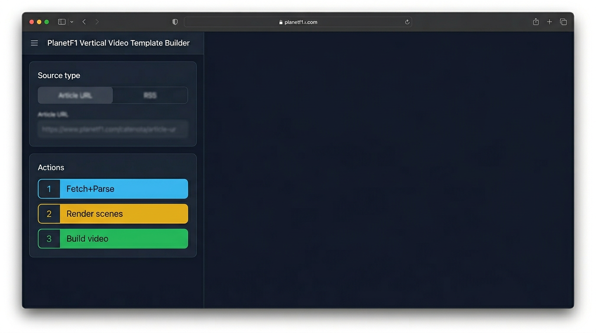
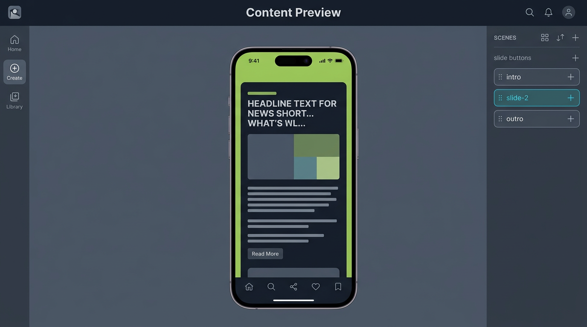
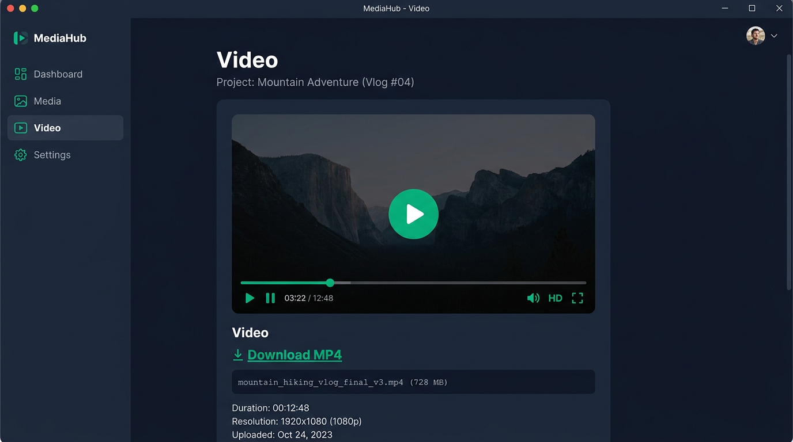

# News Shorts — Operator Manual

This document describes how **News Shorts** works in the Racing365 Social codebase: the user flow, server pipelines, data shapes, and where files land on disk.

---

## 1. What it is

**News Shorts** turns a **news article** (URL or RSS item) into a **vertical 9:16 short** with:

- Editable **slides** (intro, content beats, outro)
- **Rendered slide graphics** (1080×1920 PNGs from HTML/CSS)
- Optional **background image or video**, **camera / uploaded clip** compositing
- **Voiceover** (TTS, saved voice recording, or optional audio from a backdrop video)
- **Burned-in subtitles** (SRT + FFmpeg)
- **MP4** output plus **SEO metadata** and a **short-form engine** JSON export

**Primary UI:** `/news-shorts` → `NewsShortsBuilder` (`app/features/news-shorts/NewsShortsBuilder.tsx`).

**Stack:** Next.js (App Router), React client UI, Node API routes, **Puppeteer** for HTML→PNG, **FFmpeg** for video, local **`output/`** filesystem for assets.

**In-app manual (with screenshots):** open **`/docs/news-shorts-manual`** in the running app, or use this file for the full technical reference.

**Test runs & knowledge:** ordered **operator steps**, verification checklist, backing-music next phase, and a **JSON test-run shape** live in **`news-shorts-test-process.md`** (with **`news-shorts-test-run.schema.json`** for machine-readable logs).

---

## 1a. Screenshots (visual tour)

Illustrative UI captures for the main builder areas. Same files are served from **`/docs/news-shorts/`** in the app (`public/docs/news-shorts/`).

### Source & Actions (Parse → Render → Build)

### Content preview (9:16 + slide list)

### Video panel (preview + download)

---

## 2. End-to-end user flow

Typical sequence in the builder:

| Step | Action | What happens |
|------|--------|----------------|
| 1 | **Fetch + Parse** | Client POSTs to `/api/news-shorts/parse` with `sourceType: "url"` + `url`, or `sourceType: "rss"` + `feedUrl` (+ optional item hints). Server fetches HTML/RSS, extracts title, strapline, body, hero image, etc., and returns a **`NewsShortTemplateData`** + optional `ffmpegPlan`. |
| 2 | **Edit** | User adjusts slides, style, backgrounds, voice, SEO, timings. Draft can persist in `localStorage`. |
| 3 | **Render scenes** | POST `/api/news-shorts/render` with template → server renders each slide to PNG under `output/images/{contentId}/`. |
| 4 | **Build video** | POST `/api/news-shorts/build` with template, optional pre-rendered `images`, voice settings, backdrop paths → FFmpeg muxes PNG sequence + audio + optional video layers + subtitles → `output/video/{contentId}-short.mp4`. |

**Shortcut:** `/api/news-shorts/render-build` can combine render + build in one call (used where the client sends that flow).

---

## 3. Core data model

Defined in `app/features/news-shorts/types.ts`.

- **`NewsShortTemplateData`**: `sourceType`, `sourceUrl`, `title`, `strapline`, `author`, `publishDate`, `heroImage`, `articleBody`, `tags`, `keyQuotes`, **`slides`**, **`style`**, `notes`.
- **`NewsShortSlide`**: `id`, `type` (`intro` \| `content` \| `outro`), `label`, `headline`, `subline`, `durationSec`, `highlightWords`, **`animationStyle`** (foreground), **`backgroundAnimation`**, **`backgroundZoom`**, optional `imageUrl`.
- **`NewsShortStyleControls`**: font size, line height, text box width %, overlay opacity, panel/highlight colors, intro/outro labels, `animationEnabled`.

Slides drive both **HTML templates** (render) and **caption lines** (voice + SRT).

---

## 4. Parse pipeline

**Module:** `app/lib/news-shorts-parser.ts`  
**Route:** `app/api/news-shorts/parse/route.ts`

- Fetches article HTML (or resolves RSS → link + title).
- Extracts metadata (`og:title`, descriptions, dates, hero image where possible).
- Strips HTML with entity decoding so quotes/apostrophes display correctly in UI and renders.
- **`makeSlideCopy()`** builds a default slide list: intro, one slide per body paragraph (up to a cap), outro.
- Optional: hero URL may be **imported into library** when `contentId` is safe and image is HTTP(S).

**Output:** Template JSON the editor can change before render/build.

---

## 5. Render pipeline (slides → PNG)

**Route:** `app/api/news-shorts/render/route.ts`  
**Core:** `app/features/render/scene-renderer.ts` → `renderHtmlTemplate()` in `app/features/render/html-templates.ts`

- Each slide maps to a **template id**: `news-short-intro`, `news-short-content`, `news-short-outro`.
- **Scene `data`** includes headline, subline, labels, hero image URL, style tokens, **`animationStyle`**, **`backgroundAnimation`**, **`backgroundZoom`**, etc.
- Puppeteer loads HTML, optional **transparent background** (`editorTransparentBackground`) when motion video sits behind slides.
- PNGs are written to **`output/images/{contentId}/{sceneId}.png`**.

**Preview:** The client **Content preview** approximates the same visuals with CSS (not Puppeteer).

---

## 6. Build pipeline (PNG + audio + video → MP4)

**Route:** `app/api/news-shorts/build/route.ts`  
**Video:** `app/features/video/video-builder.ts` → `buildShortVideo()`

Rough order:

1. **Scenes** with durations and **caption text** per scene (for SRT).
2. **Audio:** If “use video audio” is not selected: **voice recording** file under `output/audio/`, else **TTS** via configured audio provider, else (when using backdrop audio) mux from video.
3. **Motion / backdrop resolution** (`app/lib/news-shorts-build-sources.ts`): determines whether the main motion clip is **camera**, **background video**, **both** (dual composite: full-frame backdrop + camera PiP), or **none**.
4. **FFmpeg** composites PNGs over optional video/image layers, applies readability dimming/layout rules (full / half / circle), burns subtitles if enabled.
5. **Manifest** append (`output/manifest.json` entry), **library metadata** update, optional **SEO filename** for downloads.

**Outputs:**

- `output/video/{contentId}-short.mp4`
- `output/subtitles/{contentId}.srt`
- `output/video/{contentId}-short-engine.json` — **short-form engine** export (layers, scenes, audio summary)

---

## 7. Motion, layout, and audio toggles

- **`VideoRecordLayout`:** `full` \| `half` \| `circle` — how **camera** (or single-stream camera file) is composed (full frame, top half + content below, circular face cam).
- **`VideoRecordCirclePosition`:** PiP anchor when applicable.
- **`resolveMotionBackdropRel`:** When both a **non-camera** background clip and a **camera** clip exist, the backdrop is treated as the **rear** full-frame layer and the camera as **overlay** (dual mode).
- **`useVideoAudio`:** When enabled with a valid backdrop, narration can come from **video audio** instead of TTS/voice file.
- **Background image vs video:** Product logic enforces **one** primary backdrop source in the UI (uploading/replacing clears the other where applicable).

---

## 8. Voice & video recording

- **Voice record:** Uploads to `output/audio/…` via `/api/news-shorts/voice-record`; optional **author name** stored in library keywords.
- **Video record (camera):** Uploads under **`uploads/{contentId}/camera-record.webm`** (or mp4) via `/api/news-shorts/video-record`; **author name** similarly; library category treats these as direct video assets.

### 8a. Backing music

Optional **backing music** is mixed under narration (and optionally ducked). Assets must live under allowed roots (see `assertAudioAssetRel` in `app/lib/editor-upload.ts`): `output/audio/`, `output/uploads/{contentId}/music/`, `output/library/music/`, or `output/generated/{contentId}/`.

- **Upload:** `POST /api/news-shorts/music-upload` — multipart `contentId`, `music`, optional `saveToGlobal=1` to copy into `output/library/music/`.
- **Library listing:** `GET /api/news-shorts/music-library` — paths under `uploads/**/music`, `library/music`, and `generated/**` for picker UI.
- **ElevenLabs generate:** `POST /api/news-shorts/music-generate` — JSON body with `contentId`, preset/mood/energy/tempo, optional `genre` / `extraPrompt`, `musicLengthSec` (3–600), `forceInstrumental` (default true), `saveToLibrary` to copy into `library/music/`. Calls ElevenLabs **`POST https://api.elevenlabs.io/v1/music`** (compose) and writes **`output/generated/{contentId}/music-bed-{timestamp}.mp3`**. Requires **`ELEVENLABS_API_KEY`** (environment variable or `elevenlabsApiKey` in local admin settings JSON).

Prompt construction is in **`app/lib/elevenlabs-music-prompt.ts`**; the builder UI is under **Backing Music** in `NewsShortsBuilder`.

---

## 9. SEO & publishing helpers

- **`app/lib/social-video-seo.ts`** generates **file name, titles, descriptions, tags, hashtags**, YouTube fields from structured input + tone.
- Build merges **user-edited SEO template** with generated defaults.
- **`/api/file`** serves `output/` files; MP4/SRT/JSON get sensible **`Content-Disposition`** names using manifest **SEO slug** / **download file name** when available.

---

## 10. Short-form engine JSON

**Module:** `app/features/news-shorts/short-form-engine.ts`

After each successful build, the API returns **`engine`** (object) and **`engineRel`** (path). The same payload is written to disk as **`{contentId}-short-engine.json`**.

It documents:

- **Video** dimensions and total duration  
- **Layers** (background / middle / foreground / subtitles) in conceptual z-order  
- **Audio** source and priority hints  
- **Scenes** with animation and copy summaries  
- **Build modes** flags (e.g. slides + middle video, full mixed)

Use it for integrations, QA, or future renderers—not as the FFmpeg source of truth (that remains the build route + `video-builder`).

---

## 11. API routes (News Shorts)

| Route | Role |
|-------|------|
| `POST /api/news-shorts/parse` | Article/RSS → template |
| `POST /api/news-shorts/render` | Template → PNG paths |
| `POST /api/news-shorts/build` | Template (+ optional images) → MP4, SRT, manifest, engine JSON |
| `POST /api/news-shorts/render-build` | Combined render + build |
| `POST /api/news-shorts/rewrite-article` | OpenAI rewrite → new template |
| `POST /api/news-shorts/voice-record` | Save voice blob |
| `POST /api/news-shorts/video-record` | Save camera video |
| `POST /api/news-shorts/music-upload` | Upload backing music file |
| `GET /api/news-shorts/music-library` | List music library paths |
| `POST /api/news-shorts/music-generate` | ElevenLabs compose → generated MP3 (+ optional library copy) |
| `GET /api/file?rel=…` | Serve files under `output/` |

---

## 12. Operational requirements

- **FFmpeg** available on the server PATH for builds.
- **Puppeteer** (Chromium) for PNG render jobs—CPU/memory intensive per scene.
- **`output/`** directory writable (images, audio, video, subtitles, manifest).
- Secrets (e.g. **OpenAI**, **ElevenLabs**) via app secret configuration where those features are used. **ElevenLabs music generation** uses the same API key as TTS (`ELEVENLABS_API_KEY` / stored `elevenlabsApiKey`).

---

## 13. Known limitations & caveats

- **Render vs preview:** Client preview is approximate; **final pixels** are always from server PNG + FFmpeg.
- **Styled ASS + voiceover:** When **Create voiceover script** has text, **burned subtitles** (ASS and plain SRT) use that **voiceover script** split across frames (`splitScriptIntoSceneCaptions`), not slide headline/subline alone. Empty voiceover field falls back to slide copy.
- **Slide count / hide rules:** Some template fields (e.g. which slides hide sublines) use **fixed indices** in render routes—unusual slide ordering may not match intent; prefer **slide `type`** when editing intro/outro.
- **Large `NewsShortsBuilder`:** The main component holds many concerns (parse, render, build, Runway, library, SEO); refactors would improve maintainability.
- **External URLs:** Parse and hero fetch depend on remote servers; failures are user-visible errors.

---

## 14. Backlog (post-test)

- **Scene subtitles / slide duration:** When **Scene subtitles & timing** ties dubbing lines to slides, long voice targets can put **too much text on one portrait frame**. Consider a **default max duration per slide** (e.g. **5 seconds**) and logic to **split** timing or content into **more slides** so each frame stays readable (implementation TBD: parse step, timing UI, or build validation).

**Addressed in code (verify in UI):** motion clip no longer duplicates in the **Video** column before build; **Content preview** overlays **voice script** dub lines when ASS burn + replace + render; **ASS** panel colour darkened toward charcoal; **Build** retries once on 5xx / bad JSON; **`maxDuration`** on build route for long FFmpeg.

---

*Last updated to match the codebase layout and pipeline described above. Screenshots live under `docs/images/news-shorts/` (and `public/docs/news-shorts/` for the web manual).*
