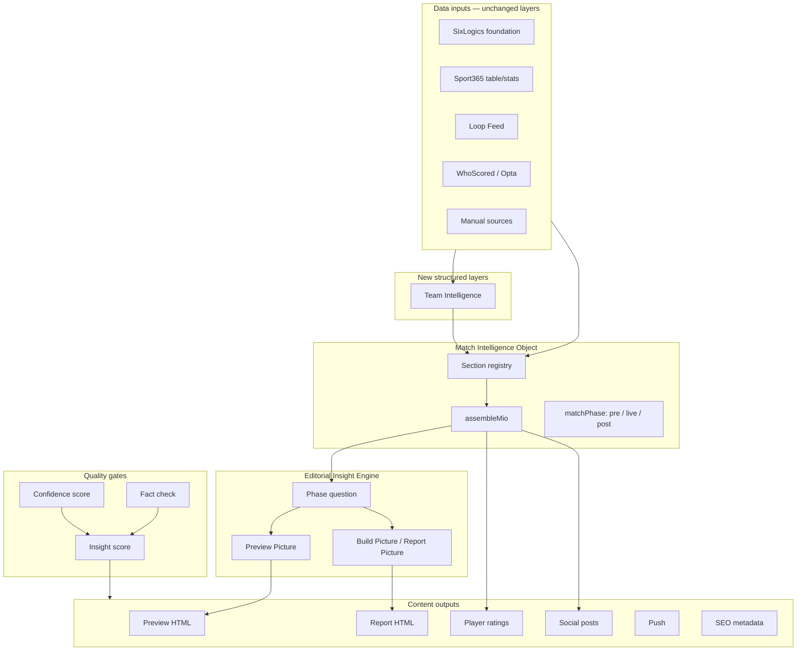

# Plexa Match Intelligence Engine — Planning & Architecture

**Product:** Planet Sport Studio (Plexa)  
**Repo:** `racing365-social`  
**Status:** Planning document — ChatGPT + editorial + Cursor synthesis (May 2026)  
**Audience:** Cursor agents, engineering, editorial (Football365 / TEAMtalk / Planet Football / Sport365)

**Companion docs:**
- [Football365 Editorial Calibration](./football365-editorial-calibration.md) — **authoritative ChatGPT decisions**
- [Football365 Preview 10/10 Scoring Engine](./football365-preview-scoring-engine.md) — **Phase 2 priority**
- [Match Report Builder R&D](./match-report-builder-rd-plan.md)
- [Match Preview V1 spec](./match-preview-v1-spec.md)
- [Match Preview editorial benchmark](./match-preview-rd-report.md)

---

## 0. Strategic thesis

### The opportunity is bigger in Match Reports than Previews

Most AI match content today is a **timeline**, not journalism:

> Goal. Goal. Half-time. Goal. Full-time.

Football365 should answer **“Why did this happen?”** not only **“What happened?”**

The same is true for previews: **“Why will this matter?”** not only form tables and injury lists.

### One engine, many outputs

**Do not build separate AI workflows** for previews, reports, ratings, social, push, YouTube, and SEO.

Build **one Match Intelligence Layer** that powers all outputs from one match object.

| Phase | Preview asks | Report asks |
|-------|--------------|-------------|
| Pre-match | Why will this game matter? What might happen? | — |
| Live | — | What is changing right now? (future) |
| Post-match | — | Why did this matter? What actually happened? What does it mean? |

**Tone, insight scoring, tactical analysis, and brand/creator DNA stay consistent** across the whole workflow.

### Do not build PIO — build MIO

| Approach | Verdict |
|----------|---------|
| EIO (reports) + PIO (previews) | ❌ Two systems, duplicated section builders, divergent quality |
| **MIO — Match Intelligence Object** | ✅ One registry, `matchPhase` + `contentType` select sections |

Pre-match, live, and post-match data all live in the same object. The **content type** decides which sections are assembled and which generation template runs.

---

## 1. Football365 Match Report 2.0 — editorial framework

Every post-match report must answer four questions:

1. **What happened?**
2. **Why did it happen?**
3. **What does it mean?**
4. **What happens next?**

If any answer is missing → report is **incomplete**.

### 1.1 Required sections (HTML / narrative)

| Section | Purpose | MIO sections that feed it |
|---------|---------|---------------------------|
| **The Story** | Lead with the biggest talking point — why the result matters | `story_context`, `stakes`, `loop_feed`, Build Picture |
| **Match Summary** | Final score, goals, key moments — max 3–4 paragraphs | `foundation`, `commentary`, `key_moments` |
| **How The Match Was Won** | Tactical heart — pressing, formations, subs, momentum | `opta_players`, `story_context`, `key_moments` |
| **Turning Point** | The moment that changed the game | `key_moments`, `commentary` |
| **Key Battles** | Midfield, striker vs CB, full-back matchups — who won and why | `opta_players`, `story_context` |
| **By The Numbers** | Possession, xG, shots — **never list without explaining meaning** | `opta_players`, `league_season_stats`, `story_context` |
| **Standout Performers** | Match winner, unsung hero, game changer — **not a ratings table here** | `player_intelligence` artifact, `opta_players` |
| **What It Means** | Table, title race, Europe, relegation, tournament implications | `league_table`, `stakes`, `fixture_context` |
| **Manager Verdict** | Likely reaction both managers | `interviews`, `loop_feed`, `manual_sources` |
| **Football365 Verdict** | Strong opinion-led close | Editorial governance + creator DNA |

### 1.2 Story lead examples (Build Picture output)

- Champions stumble again.
- Relegation fears deepen.
- A star announces himself.
- Manager under pressure.
- Title race swings.

---

## 2. Football365 Match Preview — editorial framework

Target: **800–1,500 words** for marquee fixtures (see [F365 benchmark](./match-preview-rd-report.md) — current ~7.4/10, Plexa goal **9.5+**).

| Section | Purpose |
|---------|---------|
| **The Story** | Why the game matters |
| **State Of Play** | Competition / table / stakes context |
| **Form Guide With Context** | Not raw W-D-L — explain significance |
| **Tactical Preview** | How both teams are likely to play |
| **Key Battles** | Matchups that could decide it |
| **Team News** | Absences, returns, doubts — **sourced only** |
| **Predicted Lineups** | With confidence scoring + “predicted/expected” labelling |
| **What Could Decide The Match** | Key factors |
| **AI Prediction** | Outcome probabilities — **only if odds/model data supplied** |
| **Expert Verdict** | Football365-style opinion |

### 2.1 Preview Picture (new artifact — split from Build Picture)

Today **Build Picture** asks: *What happened?*

Add **Preview Picture** asking: *Why does this game matter?*

```typescript
export type PreviewPicture = {
  storyAngle: string;
  stakes: string;
  keyBattles: string[];
  onesToWatch: Array<{ player: string; reason: string; sourceTier: "tier1" | "tier2" }>;
  predictionThemes: string[];
  tacticalPreview: string;
  factualAnchors: string[];
  toneNotes: string;
  generatedAt: string;
};
```

This becomes the **heart of the preview** before HTML generation.

---

## 3. Significance Engine (the moat — not “insight” as an afterthought)

AI tells you **what happened**. Football365 tells you **why it matters**.

**`SIGNIFICANCE_ENGINE`** is a core MIO component. Every article must answer:

1. **Why should I care?**
2. **Why does this matter?**
3. **What happens next?**

| Content type | Significance question |
|--------------|----------------------|
| Preview | Why will this game matter? What might happen? |
| Report | Why did this result happen? What does it mean? |
| Player ratings | Who influenced the game most? |
| Social | What is the shareable moment? |
| Push | What is the one line that makes someone tap? |

Output feeds Preview Picture / Build Picture and drives the **Insight** scoring dimension (20% weight on previews).

**Full rules:** [Editorial calibration](./football365-editorial-calibration.md)

### 3.1 Editorial DNA — avoid vs prioritise

**Avoid:** generic AI language · empty clichés · stats without context · repetitive phrasing

**Prioritise:** opinion · context · storytelling · tactical understanding · fan perspective

**Final test:** *Would a football fan learn something new from this article?* If not → regenerate.

---

## 4. MIO extensions (ChatGPT phase-2 additions)

Architecture score: **9.5/10**. Editorial intelligence score: **7.5/10** — next phase focuses here.

### 4.1 `creatorSignals` — Creator DNA (moat)

Not just editorial governance text — a **first-class MIO section** inherited by every output (preview, report, ratings, social, push).

```typescript
export type CreatorSignals = {
  brand: MatchReportTargetBrand;
  brandLabel: string;
  creator?: { id: string; name: string; traits: string[] };
  voiceRules: string[];
  antiPatterns: string[];
  promptBlock: string;
};
```

**Example traits:** `opinionated` · `humorous` · `fan-first` · `anti-cliche`  
**Sources (reuse unchanged):** `editorial-governance.ts`, `brand-knowledge.ts`, Language Studio creator profiles

### 4.2 `tactical_context` — 8/10 → 10/10

```typescript
export type TacticalContext = {
  homeStyle: string;
  awayStyle: string;
  primaryBattle: string;
  setPieceThreat: { home: boolean; away: boolean };
  digest: string;
};
```

Feeds **Tactical insight** dimension in the scoring engine. Without this section, tactical scores are capped.

### 4.3 `next_match_intelligence` — What happens next

Missing from both previews and reports today. Every match should answer what comes next.

```typescript
export type NextMatchIntelligence = {
  homeNext?: { opponent: string; date?: string; stakes?: string };
  awayNext?: { opponent: string; date?: string; stakes?: string };
  tableImpact?: { home?: string; away?: string };
  tournamentPath?: string;
  digest: string;
};
```

Examples: *England now face Serbia* · *Leeds move 4th* · *Arsenal cut Liverpool's lead*

### 4.4 Extended content types (post-MIO)

```typescript
export type MatchContentType =
  | "match_preview" | "match_report" | "player_ratings"
  | "social" | "push" | "youtube" | "hero"
  | "short_video" | "podcast_script" | "newsletter" | "live_blog";
```

Once MIO exists, these outputs are thin templates — same voice (`creatorSignals`), same quality gates.

---

## 5. Dual quality systems

Plexa already has **confidence scoring** (data completeness). Add **editorial scoring** (journalism quality) — **not fact-checking alone**.

**Full specification:** [Football365 Preview 10/10 Scoring Engine](./football365-preview-scoring-engine.md)

### 5.1 Confidence score (existing)

Measures: *Do we have enough data?*

Baseline 100, penalties when layers skipped (`confidence.ts`).

### 5.2 Editorial score — preview (calibrated)

| Dimension | Weight | Blocks publish? |
|-----------|--------|-----------------|
| Story | 20% | Yes |
| Insight (significance) | 20% | Yes |
| Tactical | 15% | Yes |
| Context | 15% | Yes |
| Readability | 10% | Yes |
| Originality | 10% | Yes |
| E-E-A-T | 5% | Yes |
| Commercial | 5% | **No — bonus only** |

**Core rule:** Editorial quality > commercial optimisation.

**T1 publish floor: 8.0** · **Regen: 2 auto + 1 editor** · **Hero: 9.0+ candidate + editor approval**

### 5.3 Editorial score — report (separate dimensions)

Story · Turning point · Insight · Tactical analysis · Consequence · Readability · E-E-A-T · Originality · Creator DNA (70% brand / 30% creator).

See [calibration doc](./football365-editorial-calibration.md) and [scoring engine](./football365-preview-scoring-engine.md).

### 5.4 Publishing rules (Football365)

| Overall | Action |
|---------|--------|
| **< 7.0** (tier-dependent) | Reject / regenerate |
| **7.0–7.9** | Standard |
| **8.0–8.9** | Strong |
| **9.0+** | Hero **candidate** — editor approval required |

**Human target:** 70% tier-1 previews publish with **light edits** only.

---

## 6. Current state assessment (repo — May 2026)

### 6.1 Already built ✅

| Asset | Path / module | Role |
|-------|---------------|------|
| SixLogics ingestion | `normalise-sixlogics.ts`, `sixlogics-fixture.ts` | Tier 1 foundation |
| Match Report Builder wizard | `MatchReportBuilderClient.tsx` | 9-screen workflow |
| Editorial governance | `editorial-governance.ts` | Brand, creator, E-E-A-T, layer weights |
| Brand knowledge | `brand-knowledge.ts` | F365 / TT / PF / S365 tone |
| Layer imports | `store.ts`, `api/match-report/import/*` | Sport365, Loop Feed, WhoScored, manual |
| EIO assembly | `eio-summaries.ts` | Report LLM prompts |
| PIO assembly | `pio-summaries.ts` | Preview LLM prompts (to merge → MIO) |
| Story engine | `story-engine.ts` | Deterministic events, possession buckets |
| Build Picture | `build-picture.ts` | Post-match editorial brief |
| Player intelligence | `player-intelligence.ts` | Ratings |
| Media builder | `generate-media.ts` | Report HTML, 16 conclusions, social |
| Fact check | `fact-check.ts`, `preview-fact-check.ts` | Tier 1 validation |
| Article score | `MatchReportFactCheck.articleScore` | 7 dimensions today |
| Confidence scoring | `confidence.ts`, `health-check.ts` | Skip penalties |
| Fixture calendar | `fixture-calendar.ts` | WC2026, EPL |
| Schedule dual status | `schedule-brand-status.ts`, `FootballScheduleClient.tsx` | Preview + report per brand |
| Preview content type | `contentType: match_preview` | Wizard, store, workflow |
| Preview fact-check | `preview-fact-check.ts` | No invented scores/injuries |
| Language Studio bridge | `language-studio-bridge.ts` | Review queue, publish |
| Async jobs | `jobs.ts`, build-picture-runner | Long-running AI |
| Data Studio legacy | `match-copy-ai.ts` | Raw FIXTURE_JSON preview (migrate off) |

### 6.2 In progress / partial ⚠️

| Gap | Status |
|-----|--------|
| MIO unified layer | Designed; EIO + PIO still separate in code |
| Preview media generation | `generate-preview-media.ts` not shipped |
| Preview Picture artifact | Not split from Build Picture |
| Team Intelligence layer | Manual sources + Loop Feed only — **no dedicated structured layer** |
| Insight scoring engine | ArticleScore exists but not mapped to F365 5+1 categories |
| Report 2.0 section template | `generate-media.ts` uses generic report structure |
| Live / in-play phase | Not in builder workflow |

### 6.3 Not started ❌

| Capability | Notes |
|------------|-------|
| `MatchContentType` expansion | social, push, youtube, hero |
| Editorial Insight Engine | Pre-generation question step |
| xG / SofaScore pre-match | V2 data |
| Win-probability model | Sourced simulations only |
| Regenerate-on-low-insight loop | Quality gate automation |

---

## 7. Gap analysis

| Benchmark (ChatGPT + F365 review) | Current Plexa | Gap | Priority |
|-----------------------------------|---------------|-----|----------|
| Team news / injuries dedicated layer | Filtered manual sources | No structured `TeamIntelligence` | **P0** |
| Preview Picture | Build Picture only | Need phase-specific picture | **P0** |
| MIO single layer | EIO + PIO | Merge + section registry | **P0** |
| Report “why not what” sections | Generic HTML | Report 2.0 template + prompts | **P1** |
| Insight score + publish gates | Factual ArticleScore | Map F365 categories + thresholds | **P1** |
| 1,200+ words marquee | Prompt hints only | Tier-based word counts in governance | **P1** |
| Predicted XI confidence | Lineup context block | `TeamIntelligence.expectedXi` | **P2** |
| Multi-output (social, push) | `mediaOutputs.socialPosts` partial | Content type expansion | **P2** |

### Biggest quality ceiling (ChatGPT)

| Data | Preview ceiling |
|------|-----------------|
| Without team news layer | ~7/10 |
| With team news | ~9/10 |
| With team news + predicted XI | ~10/10 |

---

## 8. Recommended architecture



### 8.1 Team Intelligence Layer (new)

**Sources:** Loop Feed · club/journalist manual sources · BBC/Sky/Athletic notes · editor overrides

**Output:**

```typescript
export type TeamIntelligence = {
  homeTeam: string;
  awayTeam: string;
  injuries: TeamNewsItem[];
  suspensions: TeamNewsItem[];
  returns: TeamNewsItem[];
  doubts: TeamNewsItem[];
  expectedXi: {
    home: PredictedXi | null;
    away: PredictedXi | null;
  };
  confidence: number; // 0–100
  sources: Array<{ id: string; source: string; tier: "tier1" | "tier2" }>;
  digest: string;
  importedAt: string;
};

export type TeamNewsItem = {
  player: string;
  team: "home" | "away";
  status: "out" | "doubtful" | "available" | "suspended";
  detail: string;
  sourceId: string;
};

export type PredictedXi = {
  formation?: string;
  starters: string[];
  confidence: number; // 0–100
  qualifier: "predicted" | "confirmed";
};
```

**Store key:** `layers.teamIntelligence: TeamIntelligence | null`  
**Import step:** after Loop Feed, before Picture — wizard step `team_intelligence` (or auto-extract from Loop + manual on `manual_sources` complete)

### 8.2 Match Intelligence Object (MIO)

Replace `assembleEioPromptSections` + `assemblePioPromptSections` with:

- `assembleMio(project): MatchIntelligenceObject`
- `assembleMioPromptSections(project): string` — LLM consumer
- Section registry: shared + phase-specific blocks (see [MIO design in prior Cursor session](./match-preview-v1-spec.md))

**`matchPhase`:** `pre_match` | `live` | `post_match` — derived from `contentType` + SixLogics status.

### 8.3 Content types (future-proof)

```typescript
export type MatchContentType =
  | "match_preview"
  | "match_report"
  | "player_ratings"
  | "social"
  | "push"
  | "youtube"
  | "hero";
```

**Phase 1:** ship `match_preview` + `match_report` only.  
**Phase 2:** add `social`, `push` as generation targets from same MIO (no new wizard).

---

## 9. Workflows

### 9.1 Preview workflow (simplified — ChatGPT CTO)

| Step | Screen |
|------|--------|
| 1 | Editorial brief |
| 2 | Match ID |
| 3 | SixLogics core + competition rules |
| 4 | League table |
| 5 | Season stats |
| 6 | Loop Feed |
| 7 | **Team Intelligence** (new) |
| 8 | Manual sources (optional extras) |
| 9 | **Preview Picture** |
| 10 | Image intelligence |
| 11 | Preview generation (HTML) |
| 12 | Fact check + **Insight score** |
| 13 | Review & publish |

**Skip for previews:** commentary · player ratings · interviews · WhoScored (V2: ones-to-watch)

### 9.2 Report workflow (upgraded — Report 2.0)

| Step | Change |
|------|--------|
| Import | Unchanged |
| Build Picture | Add Report 2.0 angle fields (`turningPoint`, `howMatchWasWon`, `keyBattles`) |
| Player intelligence | Unchanged |
| Media builder | New section template (§1.1) |
| Fact check + insight score | Reject < 7, flag < 8 on marquee |

---

## 10. Content outputs from one MIO

| Output | Words / format | Generator | Phase |
|--------|----------------|-----------|-------|
| Preview HTML | 800–1,500 | `generate-preview-media.ts` | pre_match |
| Report HTML | 800–1,500 (1,200–1,800 marquee) | `generate-media.ts` (v2 template) | post_match |
| Player ratings | HTML table | `player-intelligence.ts` | post_match |
| 16 conclusions | Numbered HTML | `generate-media.ts` | post_match |
| Social posts | X, FB, IG, Threads | `mediaOutputs.socialPosts` | both |
| Push notification | ≤120 chars | new `generate-push.ts` | both |
| SEO metadata | title + meta description | new `generate-seo.ts` | both |
| YouTube description | Hook + timestamps | new `generate-youtube.ts` | post_match |
| Thumbnail headline | Short | hero image step | both |

---

## 11. Technical roadmap

### Phase 1 — MVP plumbing (largely done / in progress)

| # | Deliverable | Effort |
|---|-------------|--------|
| 1 | ✅ `match_preview` content type | Done |
| 2 | MIO — merge EIO + PIO into `assembleMio` | 1 week |
| 3 | **Team Intelligence** layer + extraction | 1 week |
| 4 | **Preview Picture** artifact + API | 3 days |
| 5 | `generate-preview-media.ts` (MIO + F365 preview template) | 1 week |
| 6 | Preview fact-check (done) + wire insight score stub | 2 days |
| 7 | Schedule preview/report status (done) | Done |
| 8 | Data Studio → Builder migration banner (done) | Done |

**Do not build predicted line-ups UI first** — ship Team Intelligence extraction; XI confidence comes from structured layer.

### Phase 2 — Editorial intelligence (CURRENT PRIORITY — 2 weeks locked)

> Architecture 9.5/10 · **Editorial intelligence 7.5/10** — focus here.

**ChatGPT locked order:**

| # | Deliverable | Effort |
|---|-------------|--------|
| **1** | **Preview Picture** | 4 d |
| **2** | **Team Intelligence** (no social rumours in MIO) | 5 d |
| **3** | **Scoring Engine** (calibrated weights + commercial bonus-only) | 5 d |

**Delay:** tactical context V2 · fancy HTML · push/social generators

| Also ship in Phase 2 | Effort |
|----------------------|--------|
| `SIGNIFICANCE_ENGINE` MIO section | 2 d |
| `F365_BANNED_PHRASES` + humour dial | 1 d |
| Review UI: score panel + hero candidate flag | 2 d |
| Football hard cutover from Data Studio (one emergency fallback) | 1 d |

### Phase 3 — Report 2.0 + multi-output

| # | Deliverable | Effort |
|---|-------------|--------|
| 1 | Report 2.0 HTML template in `generate-media.ts` | 1 week |
| 2 | Build Picture v2 fields (turning point, tactical) | 3 days |
| 3 | `short_video`, `podcast_script`, `newsletter`, `live_blog` generators | 1 week |
| 4 | Word-count tiers by competition | 2 days |

### Phase 4 — Live + data depth

| # | Deliverable |
|---|-------------|
| 1 | `social`, `push`, `youtube` content types |
| 2 | Live phase in MIO (commentary stream) |
| 3 | SofaScore / xG pre-match |
| 4 | Win-probability (sourced only) |

---

## 12. Database / API summary

| Area | Change |
|------|--------|
| Blob `projects/{id}.json` | Add `mio`, `previewPicture`, `teamIntelligence` layer |
| Index | `insightScore?`, `matchPhase?` |
| New APIs | `GET/POST .../mio`, `POST .../preview-picture`, `POST .../team-intelligence/import` |
| Modified | `generate-media`, `build-picture`, `fact-check` → MIO + insight score |

---

## 13. What makes this hard to copy?

**Question:** *What would make this impossible to copy by another publisher using ChatGPT and the same data feeds?*

**Answer — the moat is not the data. It is the system:**

| Moat layer | Why ChatGPT + raw feed fails |
|------------|------------------------------|
| **MIO section registry** | Structured digests, tier rules, phase gating — not 120k JSON dumps |
| **Team Intelligence extraction** | Normalised injuries/XI with source IDs and confidence |
| **Editorial governance stack** | Brand × creator × layer weights × team-support mode |
| **Preview Picture / Build Picture** | Mandatory angles before prose — prevents timeline articles |
| **Dual quality gates** | Confidence (data) + Insight (journalism) + fact-check (fabrication) |
| **Story engine** | Deterministic event graph for validation, not LLM memory |
| **Loop Feed + journalist graph** | Priority reporters, social → manual source pipeline |
| **Regeneration loop** | Auto-reject < 8 on hero fixtures |
| **Calendar + schedule ops** | Preview/report/dual-brand at World Cup scale |
| **Language Studio + publish** | Human review queue with article lineage |
| **Accumulated creator profiles** | `creatorSignals` on every MIO — same voice preview → report → social |
| **Editorial scoring engine** | Calibrated vs live F365 benchmark; auto-regen below 8.0 — not just fact-check |
| **Tactical + next-match intelligence** | Structured pre/post context competitors don't normalise |

A competitor can copy prompts. They cannot quickly copy **years of normalised layers, fact-check rules, brand packets, and operational workflow** without rebuilding the engine.

---

## 14. Cursor implementation prompt (copy-paste) — Phase 2

Architecture is largely solved. **Do not ask for more architecture.** Implement editorial intelligence:

---

**Football365 Preview 10/10 Scoring Engine — Implementation Request**

Read:
- `docs/football365-preview-scoring-engine.md` (primary)
- `docs/plexa-match-intelligence-engine-plan.md` (context)

**Goal:** Plexa must score a preview **against the live F365 benchmark (7.4/10)** and **block/regenerate** below **8.0** on tier-1 fixtures — before human edit.

**Implement (in order):**

1. `preview-editorial-score.ts` — 8 dimensions, weighted overall, fixture tiers T1–T4  
2. `preview-section-lint.ts` — mandatory sections including `what_happens_next`  
3. `preview-publish-gate.ts` — fact-check + editorial score; regen if `< 8.0` (max 2 attempts)  
4. MIO sections: `creator_signals`, `tactical_context`, `next_match_intelligence`  
5. `PreviewEditorialScorePanel.tsx` on Review screen — show dimension breakdown + `benchmarkDelta`  
6. Unit tests: tier T1 must fail regen trigger at 7.4-equivalent input, pass at 8.0+

**Constraints:** Hybrid scoring (deterministic + optional LLM judge on borderline). Reuse `preview-fact-check.ts`, `editorial-governance.ts`, `brand-knowledge.ts` unchanged.

**Success:** Tactical insight dimension beats F365 benchmark (~5.5 → ≥7.5) on generated previews with `tactical_context` populated.

---

*End of planning document.*
